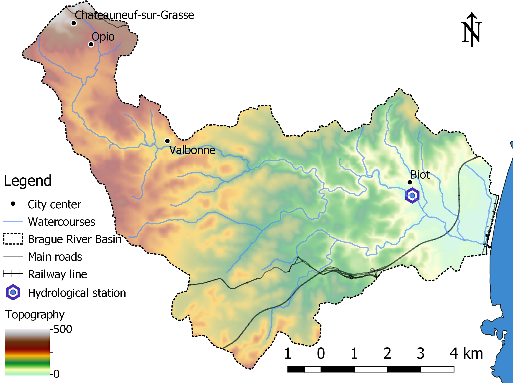
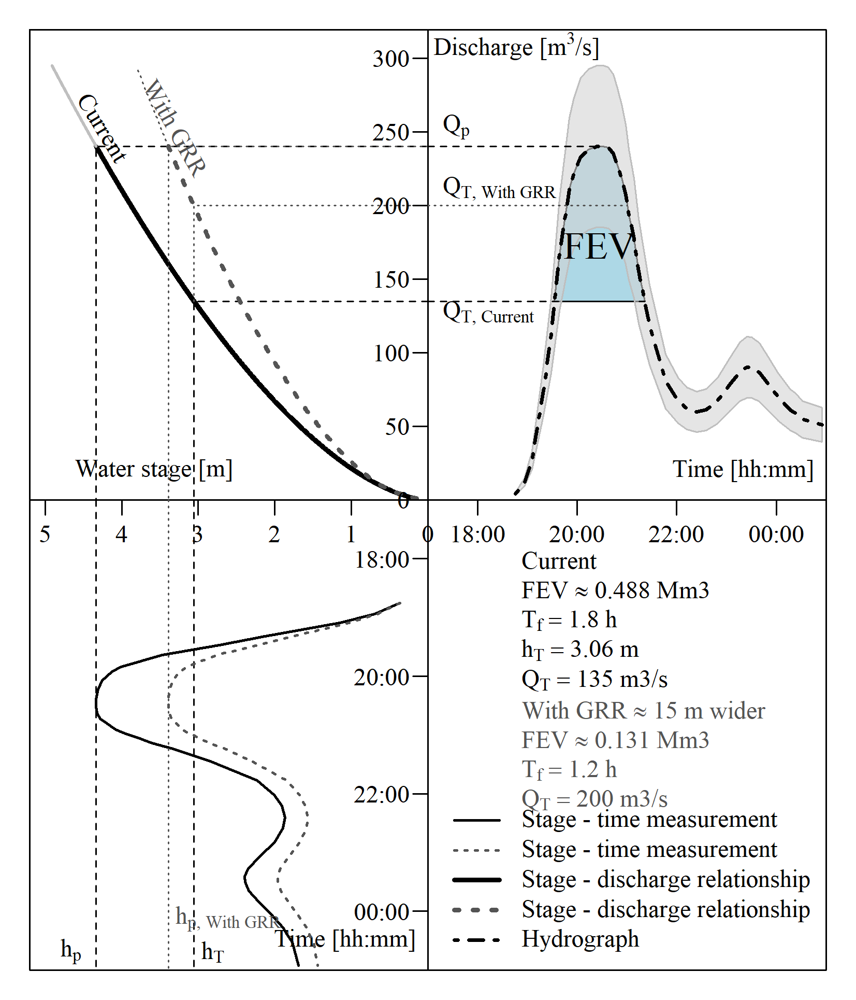
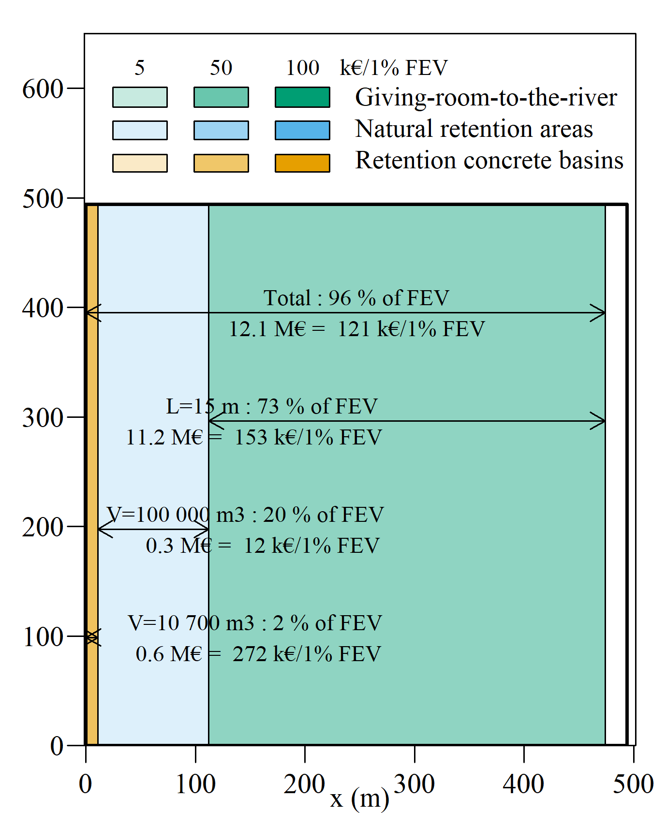

# RiverBrague



## FEV analysis of the October 2015 floods of the River Brague, France 

Work published as: 

Bokhove, O., Kelmanson, M.A., Kent. T., Piton, G. and Tacnet, J.-M. (2019): Communicating (nature-based) flood-mitigation schemes using flood-excess volume. *River Res. Applic.*, **35**, 1402-1414. [DOI](https://doi.org/10.1002/rra.3507).

*Above figure (credit: IGN data - BD ALTI 25m, BD Carto and BD Carthage - and fig. 2 in Bokhove et al, 2020): the Brague catchment in the Alpes-Maritimes region, France.*

See also technical reports:
* Piton, G., Dupire, S., Arnaud, P., Mas, A., Marchal, R., Moncoulon, D., Curt. T. and Tacnet, JM. (2018): DELIVERABLE 6.2 From hazards to risk: models for the DEMOs - Part 3: France: Brague catchment DEMO, NAIAD H2020 project (Grant Agreement no 730497). pp. 215 – 344. [online](http://naiad2020.eu/wp-content/uploads/2019/02/D6.2_REV_FINAL.pdf) (Accessed 14 September 2020).
* Piton, G. and Tacnet, J.-M. (2020): Risque d’inondation dans le bassin de la Brague (Alpes-Maritimes): ré-analyse de l’évènement d’Octobre 2015 à l’aide de la méthode du FEV.  Available [online](https://hal.archives-ouvertes.fr/hal-02866215) (in French).


### Code and output 

See ```ReadMe.txt``` for source code instructions. Note that user's working directory must be specified: ```setwd("...")```.

#### FEV calculations and cost-effectiveness analysis: Giving-Room-to-the-River (15 m)

 | 
:-------------------------:|:-------------------------:
